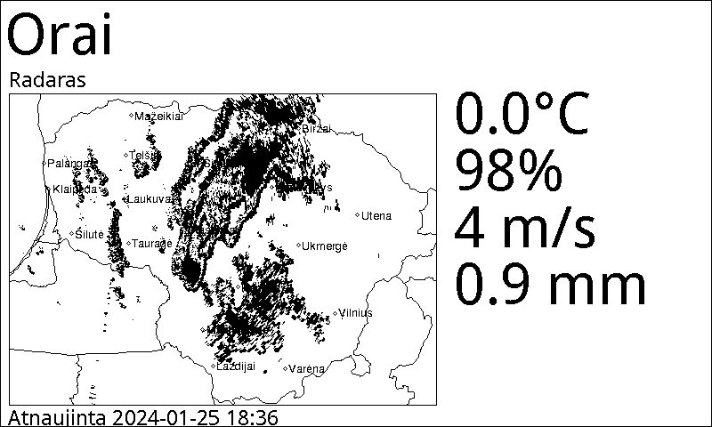

# E-Paper weather display

## Parts used

*  Raspberry Pi zero W (any should work)
*  7.5inch E-Ink Display HAT 800x480 Resolution SPI interface, don't forget interface adapter.

## Display panel driver comes from here (included):

  https://github.com/waveshareteam/e-Paper/tree/master

